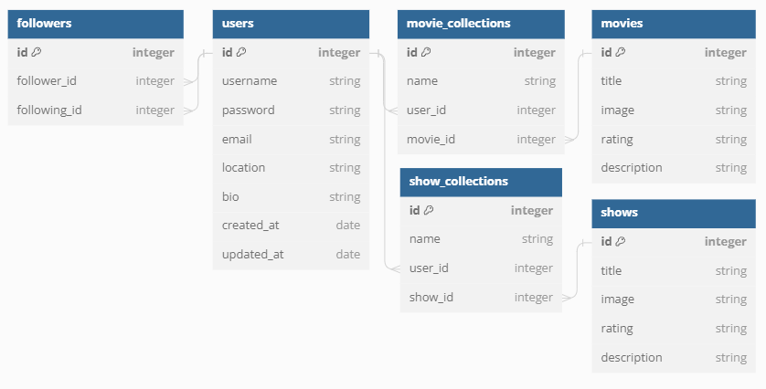

# Flicks

## Home

* [Introduction](#introduction)
* [Starting the Application](#starting-the-application)
* [.env Set Up](#.env-set-up)
* [Configuring the Database](#configuring-the-database)
* [Starting the server](#starting-the-server)
* [Starting the client](#starting-the-client)
* [Using the application](#using-the-application)
* [Attributions](#attributions)

## Introduction

- This is a full-stack web application that allows a user to keep track of movies and shows in collections and connect with users to see what they have added to their collections
- This project was made to complete the assignment `Phase 5 Capstone Project` for the `SE-West-091123` class for the [Flatiron](https://flatironschool.com/) Software Engineering Boot Camp

- [Deployed Website](https://flicks-deploy.onrender.com/)

---

## Starting the application

1. Fork and clone this repository from Github to your local environment
2. Navigate into your local directory and open the contents using your preferred code editor
3. Run `pipenv install` to install the dependencies
4. Run `pipenv shell` to create a virtual environment

### .env Set Up
##### APP_SECRET and JWT_SECRET_KEY
1. Inside your main directory, create a file and name it `.env` by running `touch .env` in your terminal
2. Inside the `.env` file, add two variables: `APP_SECRET=` and `JWT_SECRET_KEY=`
3. In your terminal, run `python -c 'import secrets; print(secrets.token_hex())'` to generate your own secret key
4. Copy the string and paste it after the `=`. It should look something like `APP_SECRET='f440a395514e01d80d85c94c4d711cc7ddbbb8073e0e5e9541c005045fc75ef7'`
5. Repeat for JWT_SECRET_KEY
6. In your `.gitignore` file, make sure you add this line somewhere: `.env`. This will keep your secret key on your local computer
##### Google Secret Keys
1. I recommend watching [this video](https://www.youtube.com/watch?v=roxC8SMs7HU) until `3:51` on how to generate secret keys using Google's API.
2. You will create three new variables:
    - `G_CLIENT_ID=` 'Your Client ID' (shown in video)
    - `REACT_APP_G_CLIENT_ID=` 'Your Client ID' (same as above)
    - `G_CLIENT_SECRET=` 'Your Client Secret (shown in video)

### Configuring the Database

In `server/models`, we define the relationships shown in the picture above between our classes and a SQLite database. Follow the instructions below to initialize the database

1. In your terminal, navigate into the `server` directory using `cd server/`
2. Run these lines of code in your terminal in the order they are presented
- `export FLASK_APP=app.py` and `export FLASK_RUN_PORT=5555`
- `flask db init`
- `flask db migrate -m 'initial migration'`
- `flask db upgrade head`
3. Run `python seed.py` to seed the database with some information

### Starting the server
- Run `python app.py` within the `server` directory to start the server

### Starting the client
1. In a separate terminal, enter the virtual environment by running `pipenv shell`
2. Run `npm install --prefix client` to install dependencies
3. Run `npm start --prefix client` to open the application in your browser

## Using the application
#### My Collection
- Upon registering an account, you will be in your collection page. Here you can create a movie or show collection depending on which mode is selected at the top (default is movies). You are also able to delete an entire collection.
#### Discover
- On the discover page, you will be shown a random movie or show with information on the right. You can either generate new content or add the movie or show to your collection that you created.
- You will now be able to go back to your collection page and view the movie/show information by clicking into the collection
#### Connect
- Here you are shown all the users that have created an account. You can follow/unfollow a user and click on them to view the content they added to their collections. If the user does not have any added media, a pop-up will let you know.
#### Profile
- You are given the option to edit your profile information and save it.
- You are also able to delete your account, which prompts an extra step for confirmation

## License

- This project is is made in conjunction with the standard `MIT` license provided by `GitHub` upon creation of a new repository. A copy of the license is included with this project in a file named: `LICENSE`.

## Attributions

- The project was authored by: `Isaac Song`
